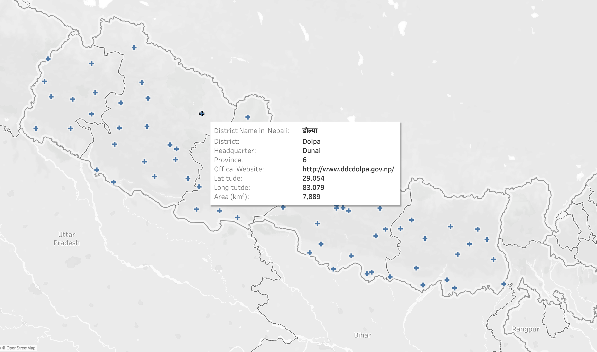

# districts-in-nepal-with-lat-long

A dataset containing the name of the district in Nepal with Latitude, longitude, and other information. This will support the creation of various forms of visualization. The dataset is scrapped from a different website.

# Data Dictionary

| Fields  | Description | 
| --------------- | --------------- | 
| S.N   | Numeric ID unique to each district.|  |
| Province  | Province name of the district in string format. | 
| District  |  Name of the district in string format. |
| Latitude | Latitude of the district in numeric format. | 
| Longitude | Longitude of the district in numeric format. | 
| District name in Nepali|  Name of the district in string format on Devanagari (Nepali script) | 
| Headquarters | Name of the district’s headquarters in string format. | 
| Area |  District area in square kilometer in numeric value. | 
| Official website|  Districtwise governmental website link. | 

# Sneak Peek of Data Visualization Created From  The Dataset 

 
## Acknowledgments

In collaboration with [Ashmita](https://github.com/ashmita-9) and thank you to all those great people who have shared the info about Nepal around the web.
